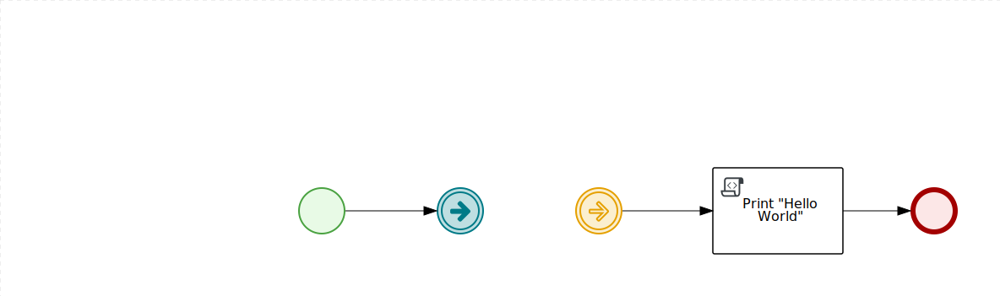
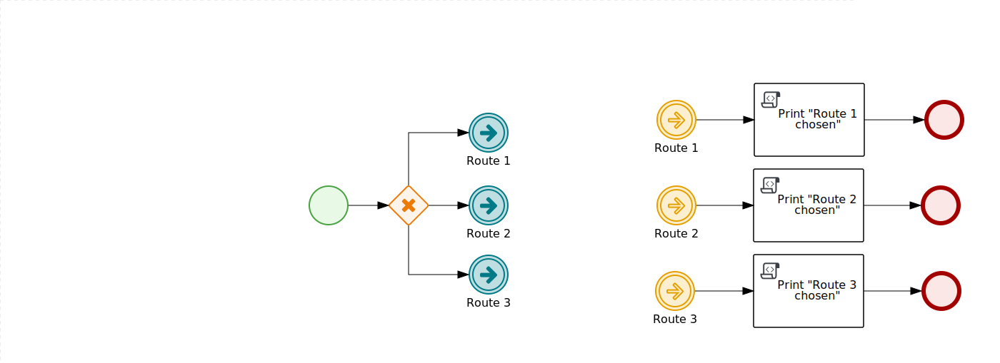
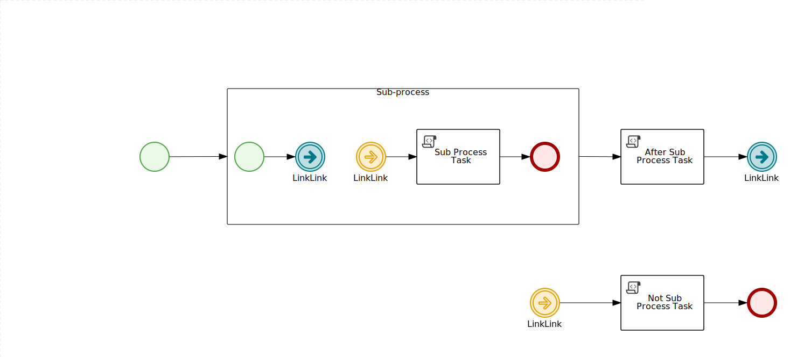

Link Events Business Central use cases
======================================

## How to use examples
Just import this repository to the Business Central starts from 7.42.Final build and deploy the project and execute processes.

## simpleLinkTest.bpmn
> Tests simple Link Events example

## WeirdLinkNameTest.bpmn
> Tests `±§!@#$%^&*()_+=-{}][:"|\';<>?/.,~` Link name

## DifferentLinksTest.bpmn
> Tests that Links with different names do not overlaps at runtime

## MultipleCatchLinkTest.bpmn
> Test one Throw Link can trigger all Catch Links with same Link name

## LoopLinkTest.bpmn
> Tests loops created by Link Events

## EmbeddedLinkTest.bpmn
> Tests that Throw Link with same name do not trigger Catch Link on another level than it's own

